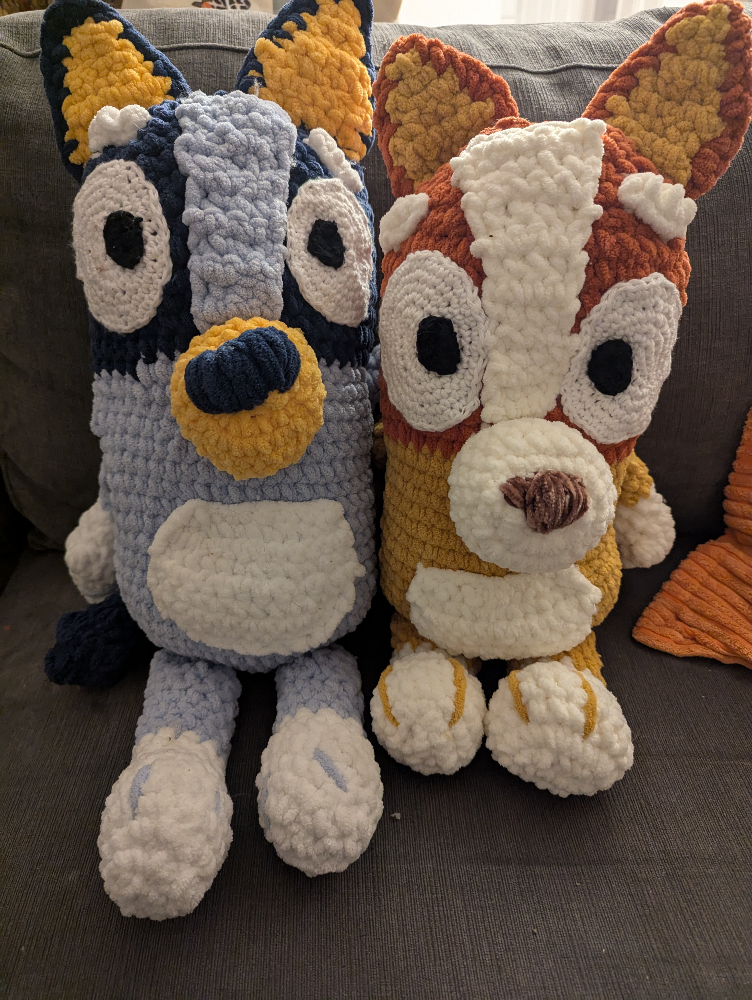
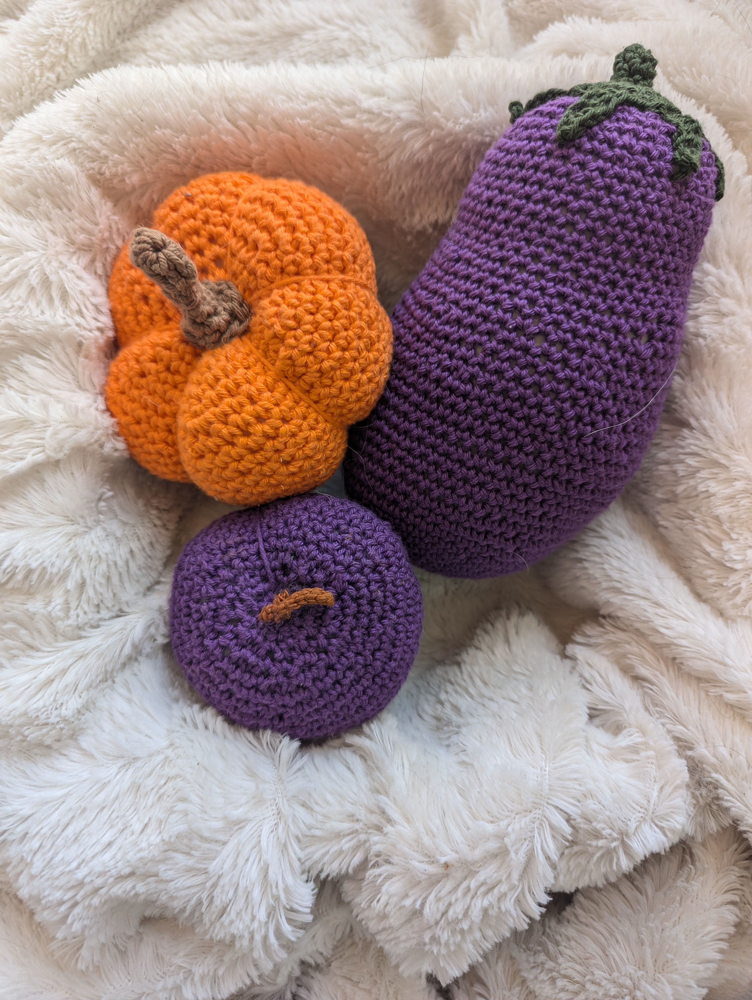

I've seen a lot of "2024 in Review" blog posts and I've been feeling reflective, so I thought I would do one of my own. 

2024 was really a year about re-discovering myself, my values, and my interests. I'm closing a chapter of my life of near constant family growing, and I'm entering 2025 a more confident, albeit tired, version of myself.

## Work

### GitHub

I spent the first couple of months this year on parental leave, and returned to work for only a couple of months before moving from the Actions team to the Billing team. Much of this year has been about ramping up in this new space and finding ways to make (and show) business impact. 

In the last month or so I have started going on-call for my new team and feel like I'm finally firing on all cylinders in this new space, so I'm very excited to see what this next year brings!

### Listening

I love podcasts and thought I'd share some of my favorites that I listened to this year:

- **Soft Skills Engineering.** I have been listening to Dave Smith and Jamison Dance for years now and it's always my number 1 engineering-related recommendation. They're both hilarious and provide (usually) good advice about soft skills situations for engineers. 
- **Book Overflow.** This is a new one I recently started listening to. The two hosts go through a technical book each week and provide their thoughts and opinions on it. It's pretty good, although a bit long for me, so I don't always finish it. 
- **The Daily.** Not necessarily work-related, but this is another podcast I listen to often. It feels work adjacent as many of the topics in the news these days impact the software industry. This is my main interaction with the news these days, since I have stepped out of most social media and reddit.
- **Scene On Radio.** This was a new one for me this year. Again, not necessarily work-related, but it feels work adjacent from a diversity and inclusion learning perspective. This year I went through Season Two: Seeing White, about anti-racism and Season Three: Men, about feminism. Both were excellent and I highly recommend them. 

### Reading 

#### Books

One of my favorite parts of my job is the book clubs. Usually one person in the organization decides that they want to do a group read of a book, and other folks join in and meet on zoom a few times if they're interested. 

This year a couple of other engineers and I decided to try to centralize those efforts a bit more and make a single Tech Book Club that anyone can start a book in. Through the book club this year I have read: 

- [The Software Engineer's Guidebook](https://www.engguidebook.com/) by Gergely Orosz
- [Domain-Driven Design](https://www.amazon.com/Domain-Driven-Design-Tackling-Complexity-Software/dp/0321125215) by Eric Evans
- [Kill it with Fire: Manage Aging Computer Systems (and Future-Proof Modern Ones)](https://www.penguinrandomhouse.com/books/667571/kill-it-with-fire-by-marianne-bellotti/) by Marianne Bellotti
- [Designing Data-Intensive Applications](https://www.amazon.com/Designing-Data-Intensive-Applications-Reliable-Maintainable/dp/1449373321) by Martin Kleppman

Outside of the book club I've also read:

- [Domain-Driven Design Distilled](https://www.amazon.com/Domain-Driven-Design-Distilled-Vaughn-Vernon/dp/0134434420) by Vaughn Vernon
- [Staff Engineer: Leadership Beyond the Management Track](https://staffeng.com/book) by Will Larson
- [Year of Yes](https://www.amazon.com/Year-Yes-Dance-Stand-Person/dp/1476777128) by Shonda Rhimes

And a few other fiction books that aren't as worth mentioning here. 

I still have some work to do to finish the summaries I planned for each one, but it has been a good year for reading.

#### Blogs

I have also been much more interested in finding and reading more voices from blogs of other engineers. It feels like we are at a turning point on the internet. As AI-generated content runs rampant, I am finding that I'm more interested than ever in individual content owned and hosted by real humans. 

I feel like I'm moving away from large networks like Substack or Medium in favor of individual blogs and newsletters. And it's a good change. 

I have been using Bluesky to find recommendations, Slack as a RSS Feed, and [this repo to collect and organize the recommendations I have received over time](https://github.com/brittanyellich/developers-who-blog). If you have a recommendation (even if that recommendation is yourself!) plus submit an issue for it!

Here are a few blog posts I read this year that really stuck with me:

- [How to review code effectively: A GitHub Staff Engineer's Philosophy](https://github.blog/developer-skills/github/how-to-review-code-effectively-a-github-staff-engineers-philosophy/) by Sarah Vessels
- [Reputation is Portable](https://aaronfrancis.com/2024/reputation-is-portable-b41ee8ac) by Aaron Francis
- [Ship it anyway](https://cassidoo.co/post/ship-it-anyway/) by Cassidy Williams
- [Tying Engineering Metrics to Business Metrics](https://medium.com/@icchasethi/tying-engineering-metrics-to-business-metrics-f4df7651e026) by Iccha Sethi

### Speaking

This was the first year in a very long time that I spoke in-person at a conference, and I loved it. I did a presentation on web accessibility at Boise Code Camp this year, and it was a very rewarding experience. I'm one of those people that actually enjoys public speaking (I know, I'm an alien) and I feel like I'm at a point in my career where I actually have things to say, so I would love to do more of this. 

### Writing

I have done much more writing this year than normal, particularly internally at my company. I think I'm finally understanding the value of it. 

For every blog post I publish, I find around 10 more new ideas to write about and explore. It has helped me make connections between different ideas in a way that I think has really accelerated my career. 

Even if I'm not writing anything new or novel, it still helps me work out my ideas in a way that I haven't been able to previously. And particularly as a remote engineer, it's an excellent outlet for the ideas that I have that I don't get to chat about with people in person anymore. 

At the same time I have struggled with developing a sustainable habit when it comes to writing. It's hard to fit into my life right now. Even this post took me much longer than I thought it would as I was juggling Christmas activities and hanging out with the kids.

I am looking for a balance between writing whenever I feel like it (which turns out to not be often when I'm not intentional about it) and the extreme ambition I had to write a blog post everyday in December. Which, uh... Clearly didn't happen.

Here are the topics I have been thinking about recently and plan to write about soon:

- How to onboard quickly to a new codebase
- How to get better at reviewing pull requests 
- How to level up the team around you as an individual contributor
- Engineering mentorship (both formal and informal)
- Refactoring over rebuilding
- How to structure a Go application
- Frontend web performance/exploring web vitals
- Taking applications from okay to a joy to work in
- The Staff Engineer role
- Setting engineering standards for a team
- Showing impact
- Learning accessibility

## Personal

### Family

My family is a huge part of my personal life, and one I don't talk about much online. My kids turned 3, 1, and 1 this year. I feel like I'm emerging from the postpartum fog after having the twins and am ready for the next stage of multiple toddlers and life with a pre-schooler. We are saying goodbye to the baby phase forever, and it's bittersweet but also so fun. 

### Hobbies

One of the more fun parts of this year is that I think I finally discovered a hobby that I love and can keep up with with three young kids. Crocheting!

I started out by doing a few projects from The Woobles that I bought during the pandemic and finally put together. That has led to a few other stuffies and a blanket this year, which have been lovely projects. Check out some pictures below!

### Health

I feel like I've started doing a better job of prioritizing my own health this year. 

On the physical side, I've been doing quite a bit of running and eating generally healthier. I did a bit of yoga in 2024 but really want to do more in the future. 

On the mental health side, this year I went to therapy for birth trauma and started a SSRI. These two moves have probably been the most life-changing for me this year. I mention them even though they may be a bit too much information, but I would love to contribute to reducing the stigma around talking about mental health issues. 

My stress level in the beginning of 2024 was through the roof. It turns out being a full-time parent and working full-time in an industry that rewards high performance is really hard. I never thought that a SSRI would help me, because I'm not depressed. So why would I need an antidepressant?

But starting one has been critical to getting me to where I am right now. It has improved my ability to step back and breathe and self reflect. And now I'm one of those people that can't talk enough about the benefits of therapy. 

## Looking Ahead to 2025

Every year on New Year's Eve I write a letter to myself using [FutureMe.org](https://www.futureme.org/), mostly talking about where I think I will be next year. It is so fun to see how things change from what I think will happen. 

Since I'm writing this year in review publicly, I thought I would write down a few of my goals and plans for 2025 as well. This way I can look back on this next year and either celebrate or (more likely) publicly shame myself for my failures. 

- **I plan to read at least 5 technical books and post summaries of them.** 5 probably sounds like a small goal. But I do a lot of fiction reading, too, and want to be realistic about my time. 
- **I plan to speak at more conferences.** This should be an easy one, given I only spoke at Boise Code Camp in 2024. I plan to submit a handful of CFPs to conferences that I'm interested in in 2025, snd I hope that at least two will be accepted!
- **I plan to write more.** This should be another achievable goal given I didn't write much in 2024. But I'm hoping to plan at least one decent blog post per month, which is a sustainable rate for me. I also plan to start a newsletter project in January, called The Balanced Engineer. I'm still working out the details on the design (I should just hire a designer) but [you can sign up early at this website](https://archives.balancedengineer.com/), if you're interested!
- **I plan to do a race.** My partner and I signed up for a Spartan Race in Fall of 2025, and I'm hoping it keeps me motivated to run this year. And that I survive doing it. 
