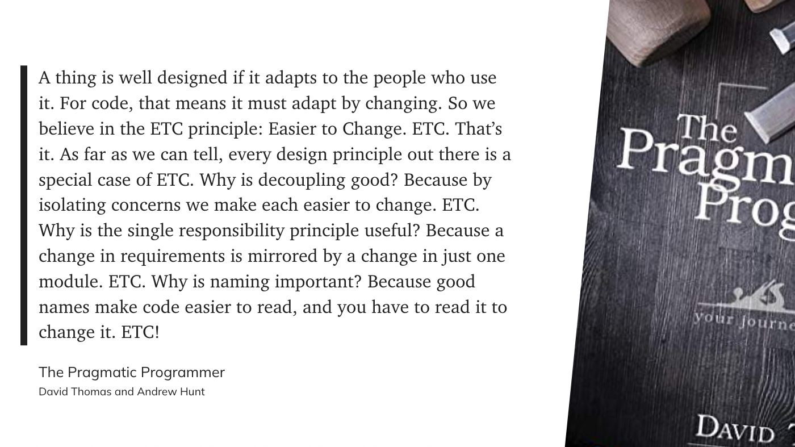
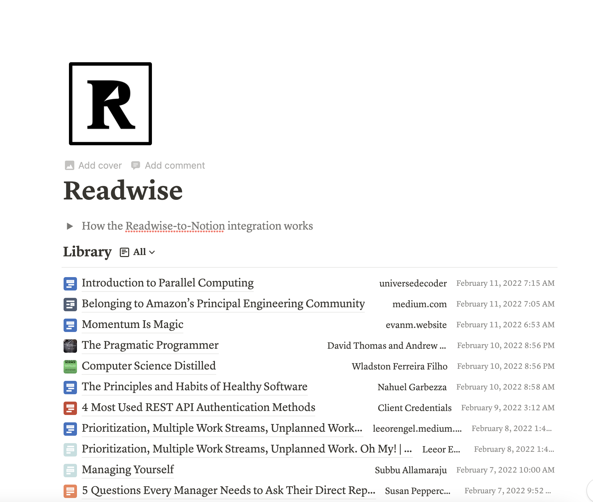
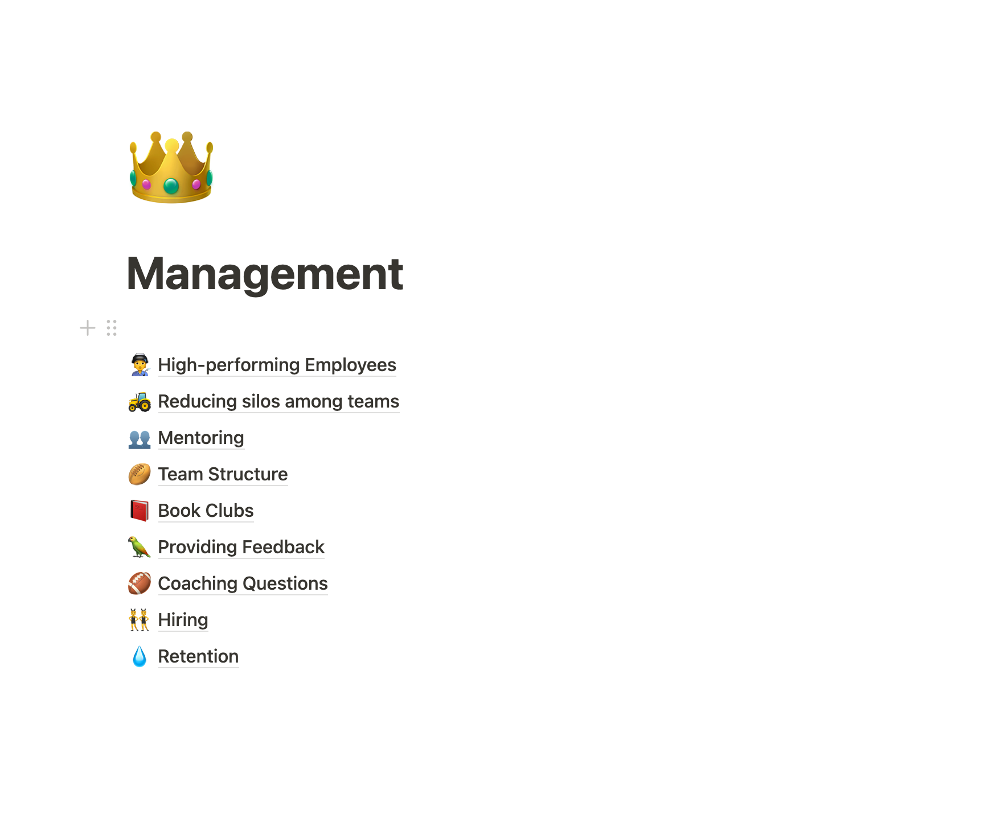

George R.R. Martin said that “A reader lives a thousand lives before he dies,” while “the man who never reads lives only one”. I would like to know, who is this reader who has the time to read 1000 books?

I love reading. There's so much to learn in the world. Particularly around technical topics that can be best learned from the experts that wrote books on it. Reading is my favorite thing to do to unwind after the day, and on a good day I get in one to two hours of reading before falling asleep.

Even with that cadence, however, I probably only complete about 20 books in a year. With over 200 books on my Amazon book list, plus a [Pocket](https://getpocket.com/) library full of hundreds or articles that I want to get through, I decided it was time to get better at reading.

In the past I would read a book, ruminate on what I learned from it for a short while, and then completely forget about it a few weeks later.

I wanted to read faster, learn more from the books I read, and retain what I learned better. And here is how I’ve gone about it.

## How to Read Faster

If you want to read more things and don’t have more time to dedicate to reading, you’re going to have to learn to read faster. Here are a few tips that I’ve helped me increase my reading speed so that I can read even more content.

**Be more selective**. This may be hard for the completionists out there to hear, but it’s okay to not finish a book. If the book you’re reading isn’t serving you, put it down and move on to something else. It’s also okay to just read the one or two chapters from a book that interest you the most, and then set the rest of the book aside.

It took a long time for me to give myself the permission to be okay with abandoning a book that I just couldn’t get through, but it has helped me to move on to things that I find more interesting.

**Stop subvocalizing.** Do you have a voice in your head that speaks every word to you as you are reading? If you want to read faster, you’ll have to get it to stop.

You can think much faster than you can speak, so subvocalizing slows down your reading pace. Try humming, or chewing gum as you read to make it more difficult for you to subvocalize what you’re reading.

**Focus**. If you’re reading to learn something, instead of reading for fun, it’s important to be in the right zone to focus on what you’re reading.

There’s a special playlist I like to listen to when I’m really focusing on something. It’s my secret weapon when I’m stuck on some particularly difficult logic or feature that I’m working on, to instantly get in a state of flow (check it out [here](https://open.spotify.com/playlist/3wt25s3vaR6fCUicwF4z8I?si=e5957f8355d5482d)!). I also like to use that same playlist when I’m trying to get myself focused on what I’m reading.

Find whatever it is that gets you into a state of flow, and set up those same parameters for your reading time. It will better help you absorb the material, and long-term help you build those muscles to get into a state of flow much quicker in the future!

**Highlight or make notes**. I use the highlight feature in the Kindle app for books (or in [Pocket](https://getpocket.com/) for articles) when I’m reading something and find something interesting that I want to revisit. The act of highlighting helps me to identify something from the piece that I found insightful and want to remember in the future.

I also like to write up a quick summary of books or articles that I found interesting, so that I can review it down the road. Making a few notes to summarize what you are reading will also help you digest and retain the information better to be able to recall it better in the future.

## How to Get More Insights and Retain Them

Reading faster to get through more content is only half the battle. In order to really gain more value from the books and articles you read, you need to be able to come back to what you’ve read easily.

**Review what you’ve highlighted.** My absolute favorite tool that has really amped up my learning in the past few months is called [Readwise](https://readwise.io/i/brittany804). It takes all of the highlights from connected apps and resurfaces a few of them each day, either in a daily email or in their web or mobile app.

It works with both of my favorite reading apps, Kindle and [Pocket](https://getpocket.com/), and works with a ton of other apps as well. There’s also a feature for several podcast apps to create a highlight from something you’ve been listening to and send it to Readwise.

Luckily, since I’ve been following the tip from reading faster to highlight things as I go, I have the most important bits from all of the books and articles I’ve read over the last few months feeding into Readwise so that I can review them each day. You can check out Readwise using this link [here](https://readwise.io/i/brittany804), and if you want to subscribe we can each get a free month!

**Make some notes from what you’ve learned.** This suggestion definitely requires more effort than reviewing your daily highlights through Readwise, but has made the biggest difference in what I’m able to learn and retain from what I read.

Readwise doesn’t only import your highlights from various apps, it also allows you to export them, which is a super cool feature.

I export all of my highlights into a notion list. From there, I can make notes from the highlights and keep the summary I wrote on the book or article, which makes it super easy to come back to in the future.

**Turn your notes from everything you’ve read into evergreen notes.** Evergreen notes are designed to be a collection of notes that cover the span of all of the things you’ve learned. A similar methodology that is a bit more difficult to pronounce is a [Zettelkasten](https://zettelkasten.de/posts/overview/).

You can take the summaries and notes you’ve written above and put them in categories in your evergreen note system, which I conveniently also keep in Notion near where all my highlights are exported. Lately I've been trying to learn how to be a better engineering manager, and you can see the fruits of the reading on it in the topics collected here.

Now I just have to hope that Notion doesn't experience a massive loss of data any time soon.

Creating evergreen notes is definitely significantly more effort than just reviewing what you’ve highlighted or making some notes based on those highlights, but the payoff is immense. This makes it easy to record and contrast interrelated thoughts from various disciplines.

For me, it also helps with keeping track of obscure computer science topics that I only revisit a few times per year, but are critical to understand well.

I’ve employed all of these tips in the last several months to improve the speed at which I’m learning and better retain what I’ve learned, and I’ve found it immensely helpful. However, unsurprisingly, I’m still trying to find new ways to get better at learning. If you have anything you’ve found that works well, I’d love to hear about it!
