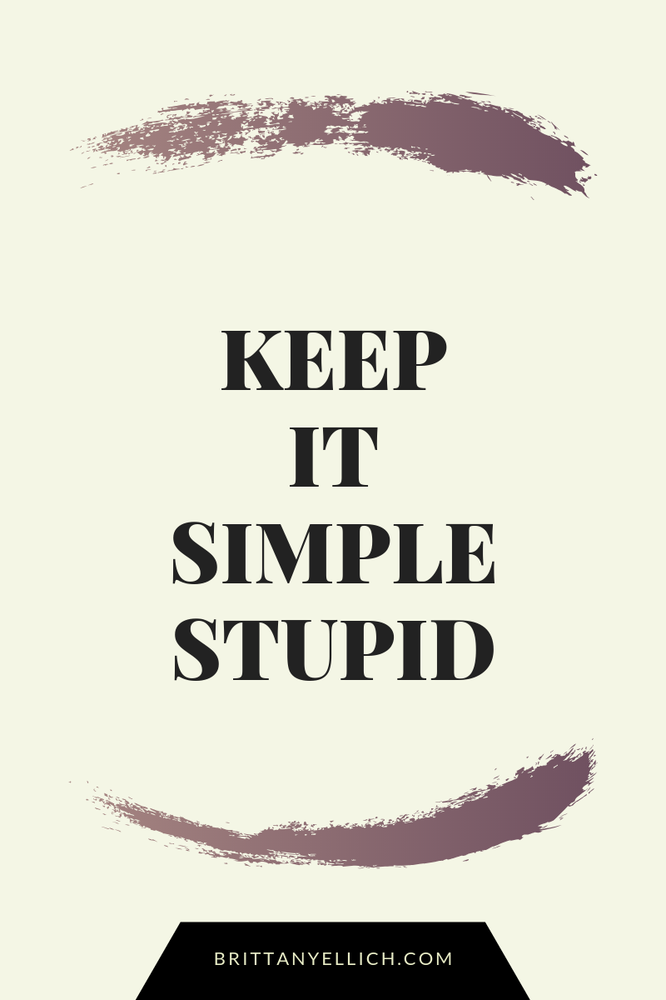

As a software engineer, I am often a victim (read: perpetrator) of scope creep. When I set out to re-engineer my personal website for portfolio projects I made when I first began building software, I had so many grand ideas for how it was going to be amazing, make my life easier, and clean my toilets while it was at it. In the design phase, I forgot one of the most important rules of designing software.

Finally after months of planning blog posts with no where to put them, I decided to pull the plug on my custom .net core back-end and react front-end, and use one of 1000s of tools that put together a site for you, [primarily using this tutorial](https://nishantdania.com/blog/guide-to-setup-ghost-gatsby-website) I found when doing research.

That's right, I used a framework for developing this site instead of doing it from scratch myself. Does that make me a bad developer? No, because doing so frees me up to do numerous other projects I'd rather work on.

I chose Ghost because I used it previously [when I wrote a blog post while working at Allata](https://allata.com/insights/how-quantum-computers-are-about-to-change-the-world). Familiarity is a huge win in my book. It's also incredibly simple to work with and a beautiful tool. I chose to use GatsbyJS because React is currently my front-end framework of choice, and what I spend a lot of my time at work doing right now.

The tutorial is a great starting point. Two major changes I made were to use the [TryGhost official gatsby starter project](https://github.com/TryGhost/gatsby-starter-ghost) as a starting point, and to use AWS CodePipeline to connect my GitHub repo to the AWS CodeBuild project, which allows me to update my website every time I push code to master. If you haven't gathered it yet, I'm lazy.

Two other tools I'm using as I start to build out the static content of the site include [this really cool color palette generator](https://coolors.co/8ea604-f5bb00-ec9f05-d76a03-bf3100) and a graphics site I am super excited to use called Canva.

Overall I'm very happy with the progress I made in just a few hours, which I had been putting off for several months. I'm glad I have the space I wanted to start writing all of the content I've had in my head about technology, design patterns, trends, lifestyle, and just about anything else.
