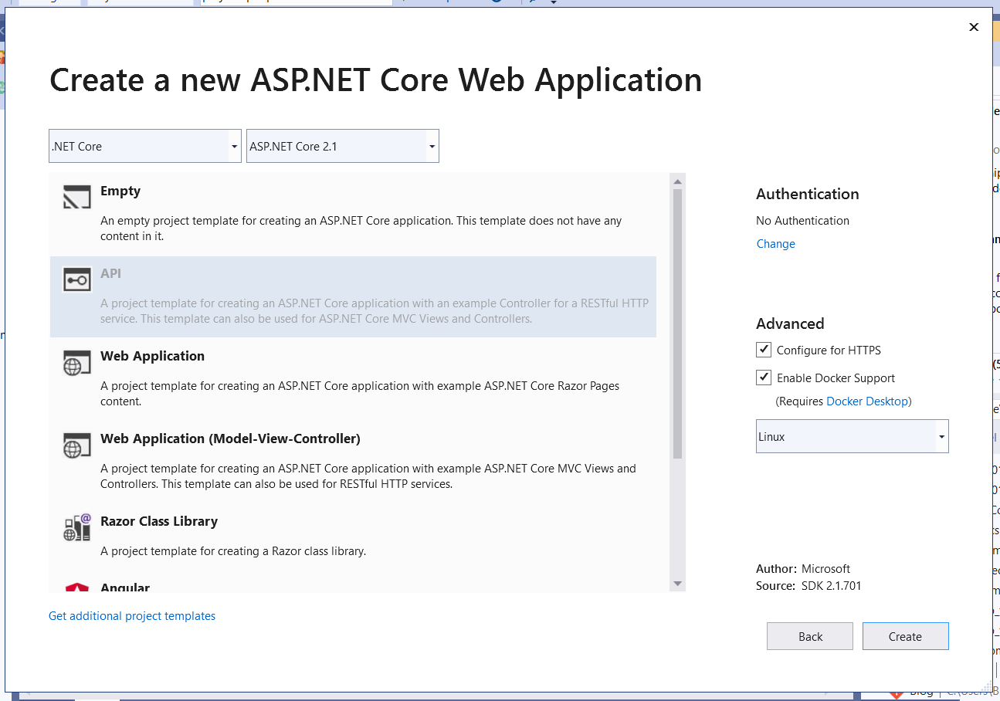

In recent months since I decided to revamp my personal website and create a new space for learning outside of work, I've developed quite the long list of projects that I would like to work on to test my skills. It has been fun, as I've been able to reflect on the site that I put together about 3 years ago or so and realize just how much I've learned. You can check out my first iteration here, if you really want to.

While I started building out the front-end of some of these projects, I came to a realization that if I really want to do things "right", I need a backend to serve up some data. Sure, since they're just projects for fun it's really not all that necessary. I could just make some ephemeral proof of concept type projects that work but reset whenever I redeploy them. But I'm a data hoarder. I want to build things that actually solve a problem in my life, as I find that that's when I get the most invested.

Enter, the quick and dirty backend API project that I just put together this last weekend. The idea is to have a single backend that I can use to talk to services like S3 or DynamoDB, and extend for the needs of any future small projects I might have.

This was a lot of fun to put together, in part because I'm excited to use it and in part because I got to dust off my C# skills that I haven't been using much recently. I decided on doing a .NET Core project simply because I enjoy building in it. That and after the BoiseCodeWorks C# course I took last year, I feel as though I can build simple CRUD applications in my sleep.

My goal for this project was to build an API that served JSON data related to a list of personal projects. Each project includes an Id, a Title, a Description, some links, and boolean values for whether it has been deleted or completed. This will eventually be used for a front-end project I have planned to keep track of personal projects, and to allow visitors to the site to add suggestions for projects. If you'd like to follow along and build this, or something similar, yourself I've included some of the steps I took and my approach for getting this up and running in just a couple of hours below.

---

## Step One: Building the API

Start out by downloading or opening up Visual Studio 2019. I use the Community edition, and it serves my needs perfectly well. I started this project by creating a new project in Visual Studio for a .NET Core API, as shown below, with HTTPS configuration and docker support included. Be sure to select Linux Docker support, as Heroku doesn't support Windows Docker images at this time.



Once your API project is up and running, add two class libraries to the solution as well. One of these class libraries should be titled 'common', and the other should be titled 'service'. I like to add new projects into a 'src' folder off of the main solution folder, to keep the folder directory tidy.

As an overview, the goal is to have a 1:1:1 relationship between a model (for the data model), a service (for any business logic), and a controller (the publicly accessible API methods). In that case, I have a Project model which the ProjectListService and ProjectListController both depend on. I also added a couple of utilities, one for handling AWS Credentials and the other for handling DynamoDB. Keeping these serparate from the ProjectListService allows the entire API to be more extensible to other use cases that may use those as well in the future.

### Project Model

I typically like to start with my data model first, so I added a folder to the common project titled 'models', and created a 'Project.cs' with the data makeup of a Project. At this point, you can adapt this model to fit whatever needs you have for your application, you just need a representation of all of the data you want to keep track of for your model.

```using System;

namespace projectApi.Common.Models
{
    public class Project
    {
        public Project(Guid id, string title, string description, string projectLink, string gitHubLink, int votes, bool completed, bool deleted)
        {
            Id = id;
            Title = title;
            Description = description;
            ProjectLink = projectLink;
            GitHubLink = gitHubLink;
            Votes = votes;
            Completed = completed;
            Deleted = deleted;
        }

        public Guid Id { get; set; }
        public string Title { get; set; }
        public string Description { get; set; }
        public string ProjectLink { get; set; }
        public string GitHubLink { get; set; }
        public int Votes { get; set; }
        public bool Completed { get; set; }
        public bool Deleted { get; set; }
    }
}
```

### ProjectListService

Next, I added two folders to the 'service' class library, one for 'services' and one for 'utilities'. In the service folder, I created a ProjectService.cs class to hold all of the business logic for the different functions interacting with DynamoDB. This includes getting all projects, getting a single project, updating a project, creating a new project, upvoting a project, downvoting a project, completing a project, and deleting a project. These are all functionality that I knew I wanted my front-end project to be able to do, so I created a method for each of them.

```using Amazon.DynamoDBv2.DocumentModel;
using projectApi.Common.Models;
using projectApi.Service.Utils;
using System;
using System.Collections.Generic;
using System.Threading.Tasks;

namespace projectApi.Service.Services
{
    public class ProjectListService
    {
        private DynamoDBService _dynamoDBService;

        private static string tableName = "ProjectList";
        private static string region = "us-west-2";

        public ProjectListService(DynamoDBService dynamoDBService)
        {
            _dynamoDBService = dynamoDBService;
        }

        private Project ConvertDocumentToProject(Document document)
        {
            string projectLink = String.IsNullOrWhiteSpace(document["ProjectLink"]) ? "blank" : document["ProjectLink"].AsString();
            string githubLink = String.IsNullOrWhiteSpace(document["GitHubLink"]) ? "blank" : document["GitHubLink"].AsString();

            return new Project(document["Id"].AsGuid(),
                document["Title"],
                document["Description"],
                projectLink,
                githubLink,
                document["Votes"].AsInt(),
                document["Completed"].AsBoolean(),
                document["Deleted"].AsBoolean());
        }

        private Document ConvertProjectToDocument(Project project)
        {
            var dynamoProject = new Document();
            dynamoProject["Id"] = project.Id.ToString();
            dynamoProject["Title"] = project.Title;
            dynamoProject["Description"] = project.Description;
            dynamoProject["ProjectLink"] = project.ProjectLink;
            dynamoProject["GitHubLink"] = project.GitHubLink;
            dynamoProject["Votes"] = project.Votes;
            dynamoProject["Completed"] = new DynamoDBBool(project.Completed);
            dynamoProject["Deleted"] = new DynamoDBBool(project.Deleted);

            return dynamoProject;
        }

        public async Task CreateNewProject(Project project)
        {
            Table projectListTable = _dynamoDBService.LoadTable(tableName, region);

            var dynamoProject = new Document();
            dynamoProject["Id"] = Guid.NewGuid();
            dynamoProject["Title"] = project.Title;
            dynamoProject["Description"] = project.Description;
            dynamoProject["ProjectLink"] = "blank";
            dynamoProject["GitHubLink"] = "blank";
            dynamoProject["Votes"] = 0;
            dynamoProject["Completed"] = new DynamoDBBool(false);
            dynamoProject["Deleted"] = new DynamoDBBool(false);

            await projectListTable.PutItemAsync(dynamoProject);
        }

        public async Task<Project> GetProjectByIdAsync(Guid id)
        {
            Table projectListTable = _dynamoDBService.LoadTable(tableName, region);
            Document projectDocument = await projectListTable.GetItemAsync(id.ToString());
            if (projectDocument != null)
            {
                return ConvertDocumentToProject(projectDocument);
            }
            throw new KeyNotFoundException();
        }

        public async Task<List<Project>> GetAllProjectsAsync()
        {
            Table projectListTable = _dynamoDBService.LoadTable(tableName, region);
            List<Document> results = await _dynamoDBService.GetAllDocumentsFromTable(projectListTable);
            List<Project> projects = new List<Project>();
            foreach(Document result in results)
            {
                projects.Add(ConvertDocumentToProject(result));
            }
            return projects;
        }

        private async Task UpdateProjectAsync(Project project)
        {
            Table projectListTable = _dynamoDBService.LoadTable(tableName, region);
            await projectListTable.UpdateItemAsync(ConvertProjectToDocument(project));
        }

        public async Task UpdateProjectDetailsAsync(Guid id, string title, string description, string projectLink, string gitHubLink)
        {
            Project project = await GetProjectByIdAsync(id);
            // These are the only things that should be publically available to update
            project.Title = title;
            project.Description = description;
            project.ProjectLink = String.IsNullOrWhiteSpace(projectLink)? "blank" : projectLink;
            project.GitHubLink = String.IsNullOrWhiteSpace(gitHubLink)? "blank" : gitHubLink;
            await UpdateProjectAsync(project);
        }

        public async Task UpvoteProjectAsyncById(Guid id)
        {
            Project project = await GetProjectByIdAsync(id);
            project.Votes++;
            await UpdateProjectAsync(project);
        }

        public async Task DownvoteProjectAsyncById(Guid id)
        {
            Project project = await GetProjectByIdAsync(id);
            project.Votes--;
            await UpdateProjectAsync(project);
        }

        public async Task CompleteProjectAsyncById(Guid id)
        {
            Project project = await GetProjectByIdAsync(id);
            project.Completed = true;
            await UpdateProjectAsync(project);
        }

        public async Task DeleteProjectAsyncById(Guid id)
        {
            Project project = await GetProjectByIdAsync(id);
            project.Deleted = true;
            await UpdateProjectAsync(project);
        }

    }
}
```

### AWS Utilities

You'll notice that the ProjectListService has a dependency on the DynamoDBService, which is what I put together next. I created two different utilities, one for DynamoDB, and one for AWS Credentials. The DynamoDB utility is dependent upon the AWSCredentialsService, so that the AWSCredentialsService can be reused in the future for other potential AWS SDK uses, such as S3.

The DynamoDBService really only needed to handle getting a DynamoDBClient, loading a table, and getting all documents from a table. There is probably more DynamoDB-related functionality that I can pull out of the ProjectListService, but the current setup suits my needs pretty well.

```using Amazon;
using Amazon.DynamoDBv2;
using Amazon.DynamoDBv2.DocumentModel;
using Amazon.Runtime;
using System;
using System.Collections.Generic;
using System.Text;
using System.Threading.Tasks;

namespace projectApi.Service.Utils
{
    public class DynamoDBService
    {
        private AWSCredentialsService _credentialsService;
        public DynamoDBService(AWSCredentialsService credentialsService)
        {
            _credentialsService = credentialsService;
        }

        public AmazonDynamoDBClient GetDynamoDBClient(string region)
        {
            AWSCredentials creds = _credentialsService.GetAWSCredentials();
            AmazonDynamoDBConfig clientConfig = new AmazonDynamoDBConfig()
            {
                RegionEndpoint = RegionEndpoint.GetBySystemName(region)
            };
            return new AmazonDynamoDBClient(creds, clientConfig);
        }

        public Table LoadTable(string tableName, string region)
        {
            return Table.LoadTable(GetDynamoDBClient(region), tableName);
        }

        public async Task<List<Document>> GetAllDocumentsFromTable(Table tableName)
        {
            ScanFilter scanFilter = new ScanFilter();
            Search search = tableName.Scan(scanFilter);
            List<Document> results = new List<Document>();
            while (!search.IsDone)
            {
                results.AddRange(await search.GetNextSetAsync());
            }

            return results;
        }
    }
}
```

Similarly, all that the AWSCredentialService does is get credentials based on an access key and secret access key for a user I put together in IAM in the AWS Console. These are stored as environment variables, because you definitely don't want anyone to access those things in source control. It basically gives any person keys to your AWS account.

```using Amazon.Runtime;
using System;
using System.Collections.Generic;
using System.Text;

namespace projectApi.Service.Utils
{
    public class AWSCredentialsService
    {
        private string accessKey = Environment.GetEnvironmentVariable("AccessKey");
        private string privateAccessKey = Environment.GetEnvironmentVariable("PrivateAccessKey");


        public AWSCredentialsService()
        {

        }

        public AWSCredentials GetAWSCredentials()
        {
            return new BasicAWSCredentials(accessKey, privateAccessKey);
        }
    }
}
```

### ProjectListController

The last step was to put together a controller in the API project. I put this in the controllers folder, added the ProjectListService as a dependency, and created a public endpoint for each of the actions I would like my front-end to be able to do. I think there's definitely some room for refactoring here in the future, since a lot of the actions are just performing the 'update' action under the covers, but I really wanted to make my front-end as dumb as possible to the logic in the backend, so that it didn't have to worry about how an 'upvote' or a 'downvote' is done, it just has to worry about sending the action through.

```using System;
using System.Collections.Generic;
using System.Linq;
using System.Threading.Tasks;
using Microsoft.AspNetCore.Mvc;
using projectApi.Common.Models;
using projectApi.Service.Services;

namespace projectApi.Api.Controllers
{
    [Route("projectlist")]
    [ApiController]
    public class ProjectListController : ControllerBase
    {
        ProjectListService _projectListService;
        public ProjectListController(ProjectListService projectListService)
        {
            _projectListService = projectListService;
        }

        // GET projectlist
        [HttpGet]
        public async Task<List<Project>> Get()
        {
            return await _projectListService.GetAllProjectsAsync();
        }

        // GET projectlist/guid
        [HttpGet("{id}")]
        public async Task<Project> Get(Guid id)
        {
            return await _projectListService.GetProjectByIdAsync(id);
        }

        // POST projectlist
        [HttpPost]
        public async void Post([FromBody] Project project)
        {
            await _projectListService.CreateNewProject(project);
        }

        // PUT projectlist/guid
        [HttpPut("{id}")]
        public async void Put([FromRoute]Guid id, [FromBody] Project project)
        {
            await _projectListService.UpdateProjectDetailsAsync(id, project.Title, project.Description, project.ProjectLink, project.GitHubLink);
        }

        //PUT projectlist/guid/upvote
        [HttpPut("{id}/upvote")]
        public async void Upvote(Guid id)
        {
            await _projectListService.UpvoteProjectAsyncById(id);
        }

        //PUT projectlist/guid/downvote
        [HttpPut("{id}/downvote")]
        public async void Downvote(Guid id)
        {
            await _projectListService.DownvoteProjectAsyncById(id);
        }

        //PUT projectlist/guid/complete
        [HttpPut("{id}/complete")]
        public async void Complete(Guid id)
        {
            await _projectListService.CompleteProjectAsyncById(id);
        }

        // DELETE projectlist/guid/delete
        [HttpPut("{id}/delete")]
        public async void Delete(Guid id)
        {
            await _projectListService.DeleteProjectAsyncById(id);
        }
    }
}
```

As a final step, to register these services with the application you will need to add them in the 'ConfigureServices' method of your Startup.cs file. Ideally, this is also where you would also be registering which class should be used for which interface, but interfaces aren't something that I touched on a project this small. That definitely isn't something I would recommend doing in a production situation, however.

```
public void ConfigureServices(IServiceCollection services)
    {   services.AddMvc().SetCompatibilityVersion(CompatibilityVersion.Version_2_1);
        services.AddSingleton<AWSCredentialsService>();
        services.AddSingleton<DynamoDBService>();
        services.AddTransient<ProjectListService>();
    }
```

You should be able to add your environment variables to your launchsettings.json file now as key-value pairs, start up the service, and see verify that each controller endpoint works as expected.

## Step Two: (Optional-ish) Securing Your Endpoints

I decided that I really didn't want to have anyone interacting with my API endpoints except through the front-end applications that I created, so decided to add a whitelist as a requirement for getting or sending data to the API. The whitelist essentially looks at the request, determines if the request is on a list of allowed senders, and then either stops the request before it even gets to the controller or allows the request to continue.

This was accomplished by adding a whitelist middleware to the application. .NET Core has a really cool concept of using middleware to intercept requests and responses that is definitely worth checking out. This is great for things like authentication, exception handling, or logging.

Creating middleware for this purpose is really simple. I accomplished this by creating a middleware folder in the API project, and creating an ApiKeyMiddleware.cs class file. The list of allowed API keys I stored in an environment variable as a comma-separated string, and then broke out into an actual list in the middleware layer. To add middleware to a request, you just need an InvokeAsync function that takes in an HttpContext and returns a Task, and then you can add whatever you want the middleware to accomplish in that function.

```
using Microsoft.AspNetCore.Http;
using System;
using System.Collections.Generic;
using System.Linq;
using System.Threading.Tasks;

namespace projectApi.Api.Middleware
{
    public class ApiKeyMiddleware
    {
        private static readonly string allowedApiKeys = Environment.GetEnvironmentVariable("APIKeyList");
        private readonly List<string> allowedApiKeysList = allowedApiKeys.Split(',').ToList<string>();
        private readonly RequestDelegate _next;

        public ApiKeyMiddleware(RequestDelegate next)
        {
            _next = next;
        }

        public async Task InvokeAsync(HttpContext context)
        {
            var headers = context.Request.Headers;
            var apiKey = headers["ProjectApiKey"];
            if (string.IsNullOrEmpty(apiKey) || !allowedApiKeysList.Contains(apiKey))
            {
                throw new UnauthorizedAccessException();
            }

            await _next(context);
        }
    }
}
```

Registering the middleware couldn't be any simpler, you essentially just need to add a line to your 'Configure' method in your Startup.cs class to add the middleware to the project:

```
public void Configure(IApplicationBuilder app, IHostingEnvironment env)
        {
            if (env.IsDevelopment())
            {
                app.UseDeveloperExceptionPage();
            }
            else
            {
                app.UseHsts();
            }
            app.UseMiddleware<ApiKeyMiddleware>();
            app.UseHttpsRedirection();
            app.UseMvc();
        }
```

From here, you should be able to add your allowed API Key list to the launchsettings.json for local testing, and test this locally by adding a header to your request in Postman. Tada! Your API just got a little bit more secure. There are definitely more things you could do, like adding JWT Authentication, but this isn't a terrible first step as long as you aren't saving any of your API Keys in source control.

### Step Three: Deploy Your App on Heroku

Visual Studio should have created a Dockerfile for your project already, but you'll have to add the other two .csproj files from your other two projects to the file. Your dependencies should be set up in a way to where your API project is dependent upon both your Common project and your Service project, so you only need to restore the API Project in the Dockerfile and the other two projects will be restored as well.

In my case I ended up opting for a much smaller Dockerfile and performing the Release step manually, instead of doing a multi-stage build with the .NET SDK and the .NET Runtime. This created a really small Dockerfile that looks like this, since the app will already be published:

```
FROM microsoft/dotnet:2.1-aspnetcore-runtime AS base

WORKDIR /app

COPY . .

CMD ASPNETCORE_URLS=http://*:$PORT dotnet projectApi.Api.dll
```

Before deploying to Heroku, make sure you have an account with Heroku and an application created. Take note of the application name as you will definitely need that for releasing the project.

If you're following the steps I took exactly, in the command line from the root of your application, do the following:

1. Run 'dotnet publish -c Release'. This will build your project into the Release folder.
2. Copy your Dockerfile into the release folder. For me this was in ./src/projectApi.Api/bin/Release/netcoreapp2.1/publish.
3. Build your Docker image. 'dockre build -t projectapibuild ./src/projectApi.Api/bin/Release/netcoreapp2.1/publish'
4. Tag your Docker image with the Heroku registry name. 'docker tag projectapibuild:latest registry.heroku.com/APPNAME/web', replacing APPNAME with your application name in Heroku.
5. While logged into the Heroku CLI, run 'heroku container:push web -a APPNAME', replacing APPNAME with the name of your Heroku app. This will push the image to the application.
6. Finally, run 'heroku container:release web -a APPNAME', once again replacing APPNAME with the name of your Heroku app.

From there, your API should be available at the website that Heroku gives you for your application. You can add your environment variables on the settings page of your application in the Heroku app as 'Config variables', and test the project to make sure it's running.

---

This was a fun and rewarding project to put together in a Saturday afternoon. There are definitely a ton of ways to harden the service, such as building an exception handling middleware and providing an error page for when exceptions occur, instead of just throwing exceptions.

I also looked into using AWS for hosting, specifically the Elastic Container Service (ECS). I spent a ton of time researching, deploying, and playing with the configuration a bit but ultimately decided that it was far too robust of a solution for what I was putting together. It was great practice for my upcoming certification exams, however!

I would love to hear your suggestions on how to improve this project, any struggles you have with the tutorial, or whether or not this was helpful!
