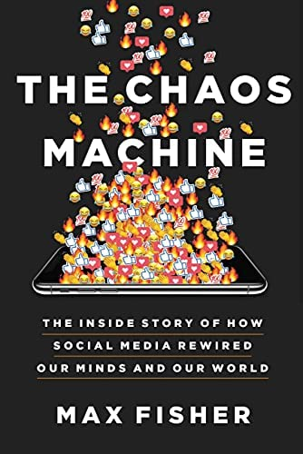

[Get it on Amazon](https://www.amazon.com/Chaos-Machine-Inside-Social-Rewired-ebook/dp/B09FJPPQQ3/ref=sr_1_1?crid=16DJBAL32EEXX&keywords=the+chaos+machine&qid=1673905080&sprefix=the+chaos+machin%2Caps%2C180&sr=8-1&tag=brittanyellich-20)

The Chaos Machine by Max Fisher is easily one of the most important books that any software engineer could read. It contains lessons that are imperative to understand for designing ethical software applications.

Here I've outlined a summary of some of the most important lessons that I gathered from the read, and then add some of my own thoughts at the end. I highly recommend it to anyone that is responsible for building applications used by humans or for anyone that has been looking around recently wondering "when did everything get so polarized?"

The book primarily focuses on the impacts from Facebook, YouTube, and Twitter, but many of the lessons can be applied to other applications like Instagram or TikTok. They're all designed the same exact way: to gain as much of your attention as possible in order to keep you on the platform and generating ad revenue.

It's important to note that the summary here is a summary based on content I read in the book, and may not reflect my own actual views. My thoughts and opinions are listed in the "Opinion" section below.

## Summary

### Social Media

In the beginning, social media was really, really cool. Most employees and founders joined or started these companies with the best of intentions: To bring the world together. It was a very fun time, where you could connect with the friends you saw every day online, sharing parts of your life that weren't shared before. Or you could reconnect with old friends that you otherwise likely would have never seen again.

After the initial push to get to the market, however, social media companies needed to start turning a profit. They did this by selling ads. The goal switched from connecting people to making sure that users spent as much time as possible on the platform, in order to gain more ad revenue.

To hook people on the platform, they introduced a dopamine hit to keep individuals scrolling, through interactive features like likes or comments. As you spent time on the site you would occasionally get a little red dot indicating a new notification, which triggered a release of dopamine in your brain as you received an indication that someone else liked what you were doing. Sometimes your photos and posts received a lot of attention, sometimes none. That variability in dopamine creates an addiction that keeps people coming back for more, on the off chance they may "hit it big" with a post or photo that would go viral.

In addition, they started promoting the content that was viewed, commented on, and shared the most. Unfortunately, due to human nature, that tends to be the most divisive content. Social media promotes "sensationalism and outrage". It changes how we "think, behave, and relate to one another", and since it is so pervasive throughout the world, has managed to change society itself in the short period of time since it was introduced.

Most social media companies that use an algorithm to promote more viral content are doing so to improve enagement. They promote conspiracies, like anti-vaccinations or pizzagate, because it allows people to feel outraged. That outrage helps people feel like they are part of the "in-group" that is actually "in the know" on these issues, as opposed to the "mainstream media" which is pushing a different story (i.e., actual facts).

These conspiracies exploit the human instinct to conform. Repeatedly seeing this information available online creates the illusion that it is widely accepted and believed. This leads people to go along with outlandish beliefs and eventually internalize the belief themselves. When people are consistently bombarded by misinformation it makes it even more difficult to reject claims that would easily be outed as false in a different context.

The book drew parallels between the polarization we are seeing today and how that was largely driven by misinformation and conspiracy theories generated and shared on social media sites. It's a truly atrocious list, which I don't plan to list in its entirety here, that has made the world a lot less safe for many millions of people throughout the world. From Gamergate to COVID misinformation to political polarization to multiple actual genocides. There are many, many more people that are in worse condition or no longer alive today due to the widespread use of social media.

Not only that, but while people have spent more and more time glued to social media apps like Facebook and YouTube, they have somehow become even less social than ever before. And with that comes a deep unhappiness that has seeped into every day life, particularly for adolescents and young adults, that now have the highest rates of suicide and depression ever on record.

It feels a bit like watching the entire world become addicted to cigarettes. It has dramatically impacted their life and livelihoods. It's just not widely accepted yet.

### Facebook

Facebook started out with an audacious goal to "rewire the world from the ground up". Zuckerberg himself believed that because Facebook was run by engineers, it would re-build the world to be better.

The people designing Facebook from the start knew that the algorithms on the site would "exploit the human brain's attraction to divisiveness", thereby gaining a user's attention and increasing the amount of time they spend on the platform. They did it anyway, despite knowing that this, and despite many of the executives denying countless studies, both internal and external, proving that this is the case.

### YouTube

YouTube, by nature of how it spreads information through videos, changes a users thinking patterns through the use of the recommendation system.

YouTube promotes the videos that have the longest viewtime and that are watched more frequently. This leads YouTubers to create longer videos than necessary (20 minutes to show you how to tie a tie??) and to try and grab your attention through click-baity titles, gimicks, or through exaggeration.

It also leads YouTubers to create videos that will entertain people and keep them writing comments and interacting. This is how misinformation spreads. A conspiracy video that gains traction through outraged comments will then be recommended in the "Watch next" feature. This pushes the video out to users that wouldn't normally interact with it, causing even more engagement as other users are pushed into watching it that wouldn't normally seek out that information.

Researchers used scraping tools to find how many videos that were suggested through the recommendation system were conspiracies. When searching for YouTube videos, they found that around 10% of videos for Pope Francis were conspiracies. However, using the "Watch next" feature, 85% of the recommended videos were conspiracies related to Pope Francis. For global warming there was a similar outcome. 15% of the videos that were returned when searching for global warming were conspiracies, while 70% of the recommended videos called global warming a hoax.

### Twitter

Twitter is a bit different from the other platforms, but it has been the master of dopamine hits. While users may tweet many times per day, each tweet is promoted to other users using the Twitter algorithm at differing levels. That means that other users will like, comment or, or retweet that tweet a varying number of times.

This intermittent interaction on what a user posts varies the dopamine hits that a user receives. The variance and never knowing if you're going to "hit it big" with a viral tweet creates an addiction much like gambling, and keeps users interacting with the platforms over and over, even if they don't actually enjoy themselves while using it.

## Opinion

Overall I thought that the book was an excellent read. It presented some ideas that I hadn't heard before, which is something that I love about reading. I haven't had the opportunity to validate all of the sources in the book, and thus can't necessarily comment on the truth of it, however a lot of the arguments in the book made a lot of sense based on my own interaction with different social media sites.

My main takeaways from the book boil down to software engineering ethics and steps to lessen social media use in my own life.

### Software Engineering Ethics

Regardless on the validity of the arguments in the book, we have established that the applications that we build can impact individuals and society. It's possible to present enough outlandish ideas frequently enough to rewire the ways that a person thinks and believes. With that, it seems imperative to chat about a code of ethics that everyone involved in the application development lifecycle should be following.

Similar to [the hippocratic oath](https://en.wikipedia.org/wiki/Hippocratic_Oath) to "do no harm", professional software engineering should be adhering to standards to ensure that software that is built does not inflict harm upon individuals or society as a whole. IEEE and ACM have proposed [this framework](https://learnlearn.uk/alevelcs/acm-software-engineering-guiding-principles/) which includes principles to protect the public, clients, and your colleagues, along with several other protected categories.

It seems worthwhile to require individuals to learn about how applications can impact human lives and how to uphold a code of ethics to minimize harm. This would be easy enough if all professional software engineers started their careers with a university degree that required that curriculum. However, with the many routes that individuals take to becoming a professional software engineer it is difficult to enforce these types of standards.

### Limiting Social Media in Daily Life

The other facet of the text, other than reducing the likelihood of developing malicious applications that may negatively impact the general public's wellbeing, is to be accountable for the social media use that you allow in your own life. For me that has meant trying to limit its use through the following:

* Deleting social media apps from my phone
* Removing the "discover" feature from my Google phone (removing the clickbait articles that are suggested every time that I open Google)
* Limiting notifications as much as humanly possible, so that I'm only notified by things I actually **need** to have my day disrupted for
* Setting time limits on other applications that take a lot of my time through the use of the digital wellbeing features on my phone

I'm not claiming that I'm perfect by any means, but I can say that I have become a lot happier now that I spend less time with my eyes glued to my phone throughout the day.

Something that I like to keep in mind is that the number of seconds in your day never changes. However, the amount of content online that is trying to capture your precious attention is growing exponentially. You can either let the internet decide how that attention is spent, or intentionally decide how you would like to do so yourself.
