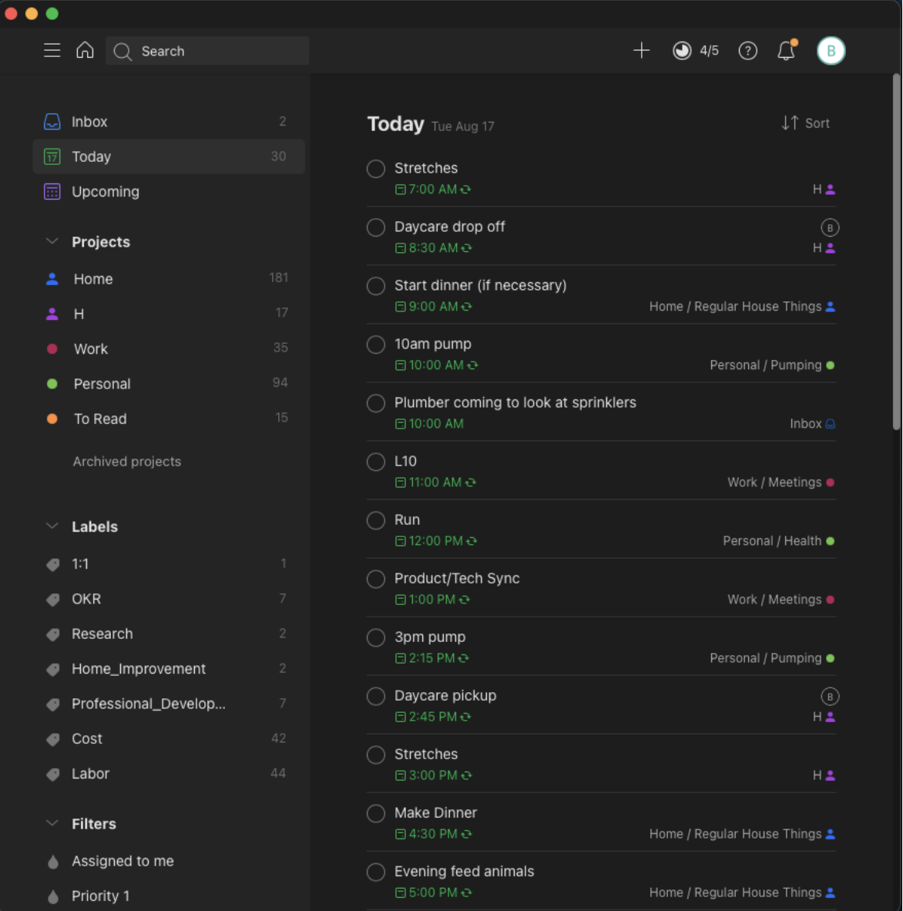

Once upon a time, I was a paper to-do list person. I would spend the beginning of my work day sipping coffee and carefully crafting boxes for each of my to-do list items for the day in my minimalist Moleskine squared notebook, basking in the feeling of being so put-together.

**And then I had a child.**

Suddenly, my to-do list wasn’t just for myself. It had expanded to encompass an entire other human, with all of her appointments and daily needs such as taking vitamins or dropping her off at daycare. My free-time disappeared and suddenly the DIY projects that I love so dearly were floating around in my brain with weekly chores, like grocery shopping, and upcoming calls and appointments.

It felt like there was a fluorescent light buzzing in my brain, constantly reminding me of the tasks I had to complete on my ever-growing list. **I couldn’t sit down without thinking about what I had to add to the grocery list, or what I needed to remember for our next pediatrician appointment, or about how dirty our floors were and that I needed to vacuum soon.** I needed to find a way to ease the burden of being the household manager, since as the partner working from home I was already responsible for a good majority of the household tasks.

Enter Todoist.

A simple, free app that took only minutes to learn how to use and has significantly improved my organization capabilities. Adding tasks, scheduling a day, and checking them off as you go is pretty straightforward. In this post I explain how I use Todoist to organize my life and act as our household manager, so that we can focus on what’s most important.

A note for the reader, I am not paid by Todoist to make this post.. I really am just a Todoist evangelist. If they wanted to pay me for it, I’d be interested, though!

I use Todoist for many things, including organizing my work, planning workouts, recording weekly chores, keeping track of all of the daily things I have to do for H, remembering birthdays… Pretty much any list or reminder you can think of it can be used for. It allows me to offload a lot of the mental burden of remembering what to do, so that I can just focus on doing it and moving on to whatever is next.

## Organizing Household Chores

Organizing reoccurring household chores was the very first thing that I started using Todoist for. I tried several other apps in the past to organize these things and never came close to the versatility that Todoist gives me. I have some tasks set to reoccur every week (changing the sheets), every two weeks (mowing the lawn), or monthly (cleaning the bathrooms), so that we never forget to get them done.

To handle the household with two working parents, we ruthlessly prioritized which household cleaning items we cared the most about. The rest of them just don’t get done, or only get done when they become annoying enough to add as a one-off task to Todoist.

Now I’m actually remembering to do things like clean the bathrooms regularly and change out our towels for fresh ones on a regular basis.

Household tasks are also great candidates for assigning to different people, to make sure that you and your partner are sharing the load of keeping the household in order, which is very important with two working parents!

## Remembering Birthdays and Anniversaries

There’s nothing that I love more on my birthday than getting a text, phone call, or a card from someone that actually remembered it. Ever since Facebook started handling birthdays, it seems like no one cares about birthdays outside of Facebook.

This is yet another good candidate for Todoist. There are many people on my Birthdays and Anniversaries list that I like to remember to do something personal for. Some of my friends get a text, others I like to call every year, and for my nieces and nephews I always like to send them a gift.

Using Todoist, I set a subtask with enough time to order a present or send a card, so that birthdays never get missed.

## Creating Lists

My partner often makes fun of me because the first thing I say when planning anything is “I need to make a list!”. Todoist is a great place to make these lists.

Packing for a young child can be incredibly stressful, because there is so much stuff that you need to remember. Luckily lists in Todoist can be duplicated and assigned to different days, so that you don’t have to remember everything from scratch each time you need to pack. I have a packing list with all of the essentials so that when we need to head out of town, I just copy that list to the day that I need to pack on.

Using Todoist in this way has been an absolute lifesaver as we have spent a ton of time heading to the grandparent’s house this summer!

## Planning for Holidays and Events

Holidays and events give me Major Stress. Remembering all of the people that you need to buy Christmas gifts for or setting aside time to decorate isn’t something that just happens… It takes careful thought and planning to pull it off every year.

I’ve added a subtask under “Gifts” for each friend or family member that I need to make sure we have a gift for. I use the description field to keep track of ideas as they come to me throughout the year, so that when Black Friday rolls around I’m ready to go!

The best part? This list of gifts can be duplicated and copied to the NEXT Christmas task, so that you don’t have to start that list from scratch every year!

## Planning DIY Projects

I’ve created a task for each of the areas in my house that I have home improvement plans for, such as the laundry room or the living room. From there, I add sub-tasks to organize my ideas. There’s a description for each task that can be used to write down specific plans or ideas as you think of them. This is great for those middle-of-the-night “What if we painted the laundry room red?” thoughts.

I created labels that are used across each subtask for “Cost” and “Labor”. You can filter tasks by these labels and sort them so that you can prioritize what is the next thing you want to work on the next time you have some additional money or time laying around! This way when I have extra time on a weekend I can look through my “Labor” list and pick something to get done.

## Organizing Work

To organize my work, I create a task for each work item with the due date on which that work item or post should be ready by. Sub-tasks can then be used to organize what needs to be accomplished to finish the top-level task, and those can be assigned to dates prior to the top-level task due date so that you can check off milestones as you go to complete your project.

I have yet to find an organization project that using Todoist can’t help me with. It has been a breath of fresh air getting all of these tasks out of my head and into an app that can sync across all of my devices, so that I can focus on crossing items off the list, instead of stressing about what to get done next.

As I was writing this post, I received an email from Todoist that I’m in the top 1% of Todoist users, and I can see why! It has transformed my life completely. That fluorescent light buzzing in my head has been turned off and I can now redirect that constant stream of to-do items to Todoist to give my brain a break. I hope that you can use it to gain that mental clarity as well. I would love to hear in the comments how you use Todoist, or any other tool, to organize your life as well!
