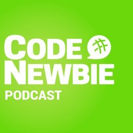
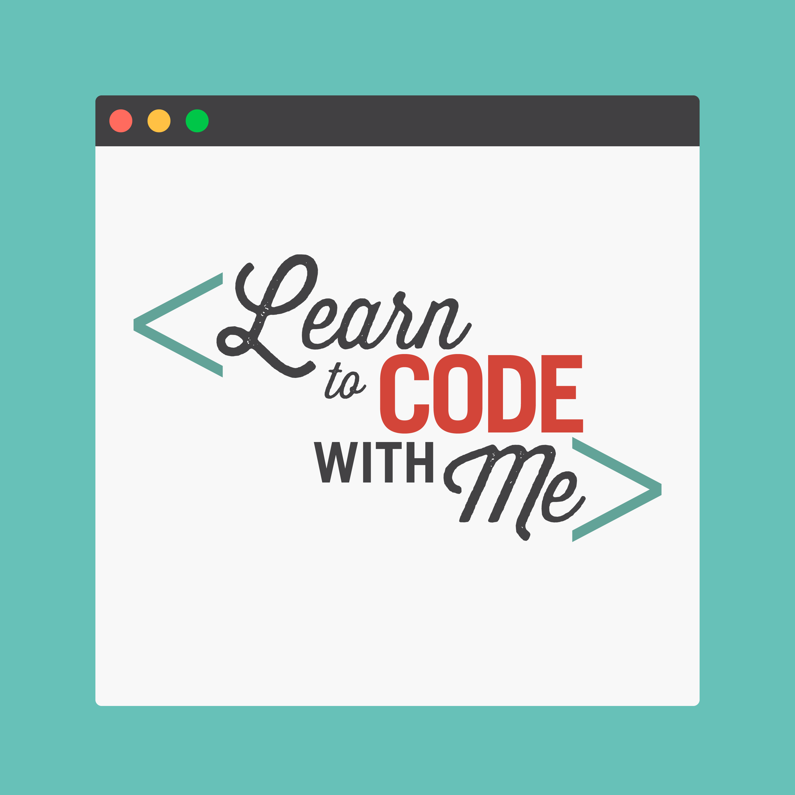
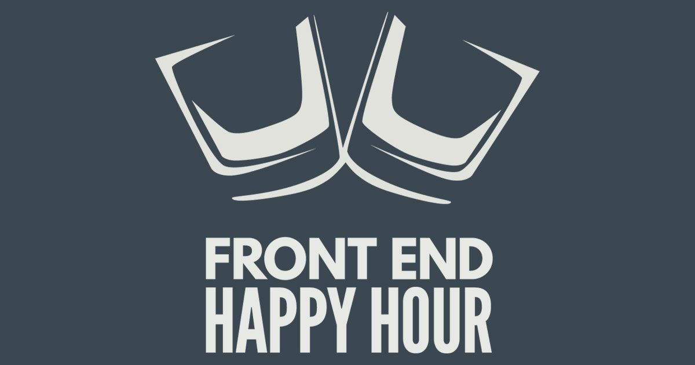
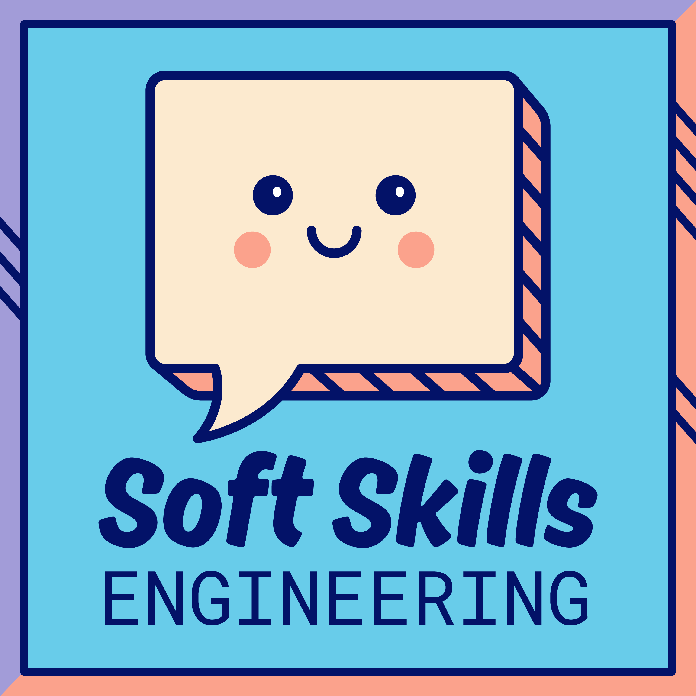

Podcasts have really made a comeback since they were first introduced. It seems like in the last 3-4 years, the number and variety of podcasts have really exploded. When I first started my transition to working in software, I thought that podcasts would be a great way to utilize all the time I was spending in the car. However, I really struggled trying to figure out which podcasts really worked for helping me learn at the beginner level. Many of the podcasts out there seemed to be individuals sharing their opinions about certain technologies, instead of describing what those technologies were or how to use them.

I've found that any time I spend in the car or with time to kill, listening to a podcast helps me to get that extra ounce of productivity and entertainment out of my day. Here's a list of the top 5 best podcasts, based solely on my own ranking system of my own personal preference!

---

## [#5 - CodeNewbie](https://www.codenewbie.org/podcast)

The CodeNewbie podcast shares stories and insights from individuals about their career journey. I found this podcast incredibly useful when I was first starting my career as it helped me to understand that many people in tech end up there on a very windy path like myself, filled with sharp corners and pit stops along the way. It was helpful to learn that I was doing the right thing to transition to my career, and to realize that there are many different avenues you can take to keep moving forward.

## [#4 - Learn to Code With Me](https://learntocodewith.me/)

The Learn to Code With Me podcast tends to focus primarily on the journeys of self-taught developers and individuals with a non-traditional background. It provides useful tips for people looking to get into tech that may not know where to start, and so is a great starting point for anyone who is very new to the field.

## [#3 - JavaScript Jabber](https://devchat.tv/js-jabber/)

If you're just learning to code and trying to decide which language to start with, I highly recommend JavaScript. It is incredibly versatile and highly accessible to new learners. I find that developing in JavaScript genuinely makes me happy (although I know a few co-workers of mine that would disagree).

JavaScript Jabber is a podcast from the [devchat.tv network](https://devchat.tv/) that is far more than just a clever alliteration. The hosts often talk about technical issues not only limited to JavaScript, but also related to other relevant technologies like Azure and Kubernetes, in a way that is easy to understand for people who have very limited experience.

## [#2 - Front End Happy Hour](https://frontendhappyhour.com/)

While I tend to take full-stack jobs, I find that there is often more interesting developments occurring in the front-end space than in the back-end space. Thus, I often listen to more front-end focused podcasts. Front End Happy Hour is one that I've found particularly interesting, both due to the fun drinking-game-esque format as well as the diversity of opinions showcased on the show. They often have 3-4 regulars as well as at least one special guest on each show, which provides a diversity of opinion that is very refreshing.

## [#1 - Soft Skills Engineering](https://softskills.audio/)

This podcast has almost nothing to do with technology by design and everything to do with how to do well in your job otherwise. I find that technology skills are relatively easy to learn, while soft skills can be more difficult to master. The two co-hosts give highly relevant and often hilarious advice for how to handle difficult situations at work.

I'm always interested in new podcasts, so please share with me what your favorite podcast is, tech or otherwise!
