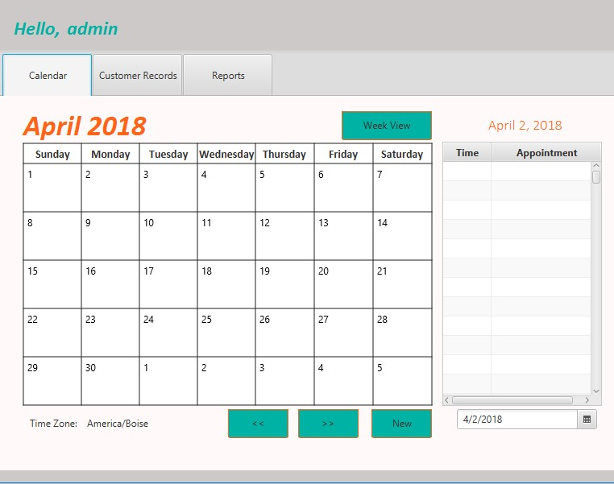

### Summary

This was a project as part of my course work at Western Governor's University (WGU). The goal was to build a calendar with the ability to set appointments and keep track of customer information.

Check out the [link to the GitHub repo here](https://github.com/brittanyellich/TimeTidy2).
