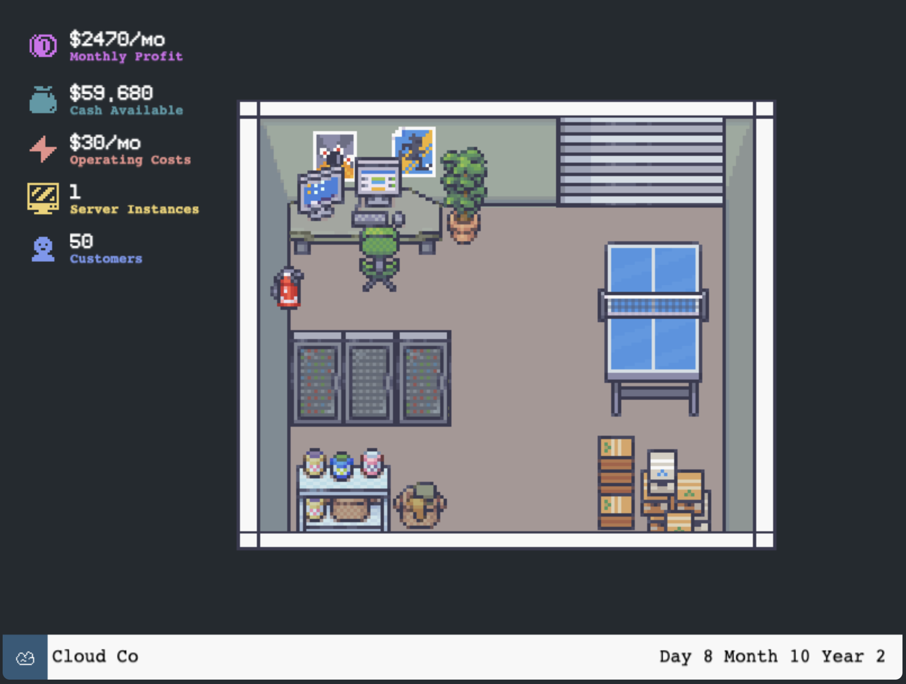

### Summary

This project was part of the [itch.io 2022 game jam](https://itch.io/jam/game-off-2022). With a team of other engineers from work, we built a game called Cloud Tycoon using Phaser. The goal of the game is to build the best cloud enterprise, outcompeting other enterprises for the most market share!

The theme for this game jam was "cliche". We implemented cliche's in our level naming, most of the copy for the game, and with our super-cool pixelated graphics!

This was a super fun project to build. It was my first time using Phaser and first time building a full game from scratch that is actually [playable on the internet](https://brittanyellich.itch.io/cloud-tycoon).

Check out the [link to the GitHub repo here](https://github.com/knot-games/cloud-tycoon).
