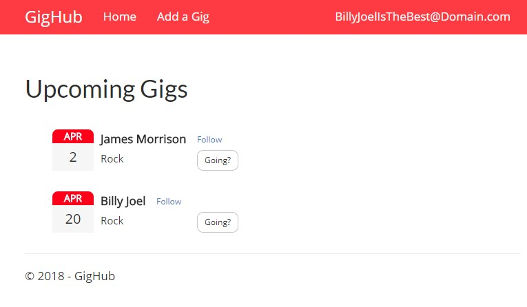

### Summary

GigHub was a project that I built to become more familiar with C#, .NET, and Entity Framework as I was preparing for my roll at Allata. The project shows and keeps track of upcoming concerts.

Check out the [link to the GitHub repo here](https://github.com/brittanyellich/GigHub).
