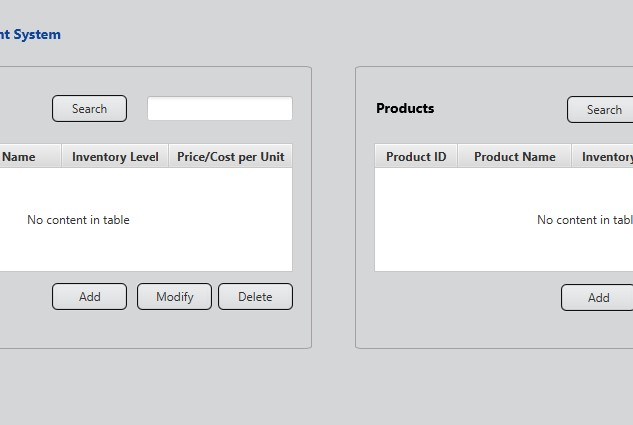

### Summary

This was a project as part of my course work at Western Governor's University (WGU). The goal was to build a desktop application to keep track of inventory.

Check out the [link to the GitHub repo here](https://github.com/brittanyellich/InventoryManagementSystem).
