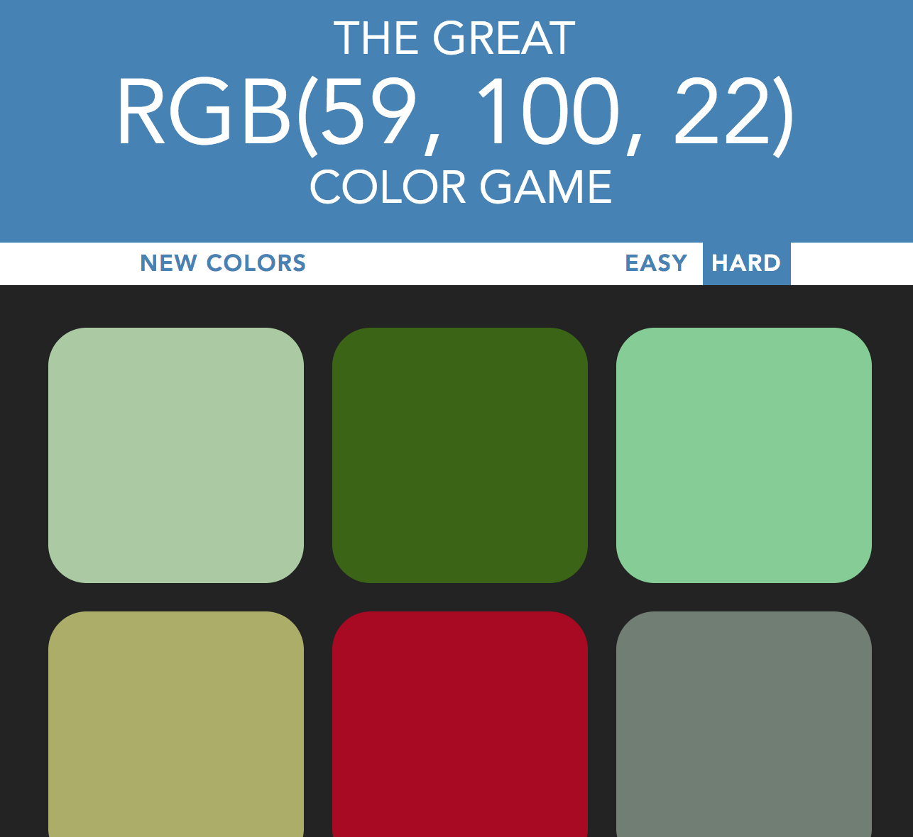
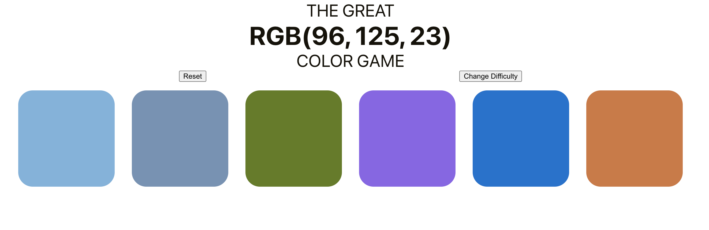

### Summary

I originally built this game back in 2018 when I was first learning some frontend basics as part of one of Colt Steele's Udemy courses.

While I was rebuilding my website, however, I decided that I wanted to move some of my past portfolio projects into a new react app so that I could continue to build small things on this site over time.

That's when I moved the game over to my new [projects.brittanyellich.com](https://projects.brittanyellich.com/color-game) site. You can check it out at that link! The new game is shown below. I still have a bit of work to do on it (I'm really not much of a designer) but I'm excited to see how much my skills have grown and how quick this was to throw together.

